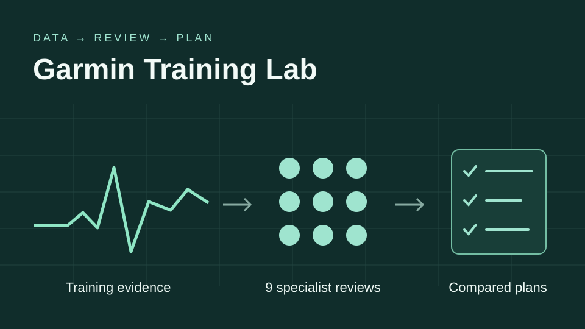
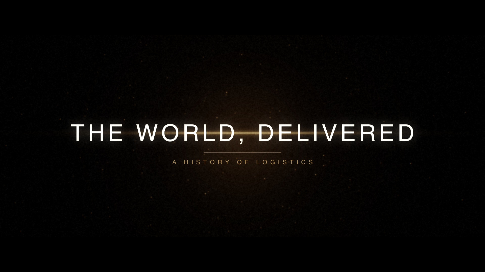

# Jonathan Angel

**AI tools · Applied software · Creative experiments**

I build tools that turn information into useful decisions, from freight operations and personal styling to running analysis. I also explore what can be made with code beyond software, including animation and music.

## Featured

<table>
<tr>
<td width="50%" valign="top">

<h3>Garmin Training Lab</h3>

Turn Garmin training history into evidence, nine specialist reviews, and compared running plans. Inspect the reasoning, disagreements, and proposed next steps.

Python · Garmin data · AI analysis

<a href="https://github.com/jonathanangel-1/garmin-training-lab"><strong>Explore the app →</strong></a> · <a href="https://github.com/jonathanangel-1/garmin-training-lab/releases/latest">Latest release</a>

</td>
<td width="50%" valign="top">

<h3>The World, Delivered</h3>

A two-minute history of logistics, from ancient trade routes to autonomous systems. Procedural animation and an original score, generated in code.

Python · Animation · Audio synthesis

<a href="https://raw.githubusercontent.com/jonathanangel-1/History-of-logistics-vid/31314bb198e7f53be4d71d1f676f163e8e7de741/history_of_logistics_web.mp4"><strong>Download the film →</strong></a> (MP4 · 39 MB) · <a href="https://github.com/jonathanangel-1/History-of-logistics-vid">How it's made</a>

</td>
</tr>
</table>

## Applications

<table>
<tr>
<td width="33%" valign="top">

<h3>JD Direct</h3>

Freight brokerage from an emailed quote request through carrier verification, delivery, and invoicing.

<a href="https://github.com/jonathanangel-1/jd-direct-public">Source</a> · <a href="https://github.com/jonathanangel-1/jd-direct-public/blob/main/docs/REVIEW.md">Walkthrough</a> · <a href="https://github.com/jonathanangel-1/jd-direct-public/blob/main/docs/ENGINEERING.md">Design</a>

</td>
<td width="33%" valign="top">

<h3>PQ Ops</h3>

A shipment control room that connects source evidence, conflicting updates, and the next action.

<a href="https://github.com/jonathanangel-1/pq-ops-public">Source</a> · <a href="https://github.com/jonathanangel-1/pq-ops-public/blob/main/docs/REVIEW.md">Walkthrough</a> · <a href="https://github.com/jonathanangel-1/pq-ops-public/blob/main/docs/ENGINEERING.md">Design</a>

</td>
<td width="33%" valign="top">

<h3>Angie</h3>

Personal styling that connects inspiration, product recommendations, fit, and feedback from tried sizes and keep/return decisions.

<a href="https://github.com/jonathanangel-1/angie-public">Source</a> · <a href="https://github.com/jonathanangel-1/angie-public/blob/main/docs/REVIEW.md">Walkthrough</a> · <a href="https://github.com/jonathanangel-1/angie-public/blob/main/docs/ENGINEERING.md">Design</a>

</td>
</tr>
</table>

These three applications are public editions with fictional data and local demos. Each includes setup instructions, engineering notes, and reproducible checks. Garmin Training Lab runs locally and uses your own Garmin and ChatGPT accounts for collection and AI analysis.
